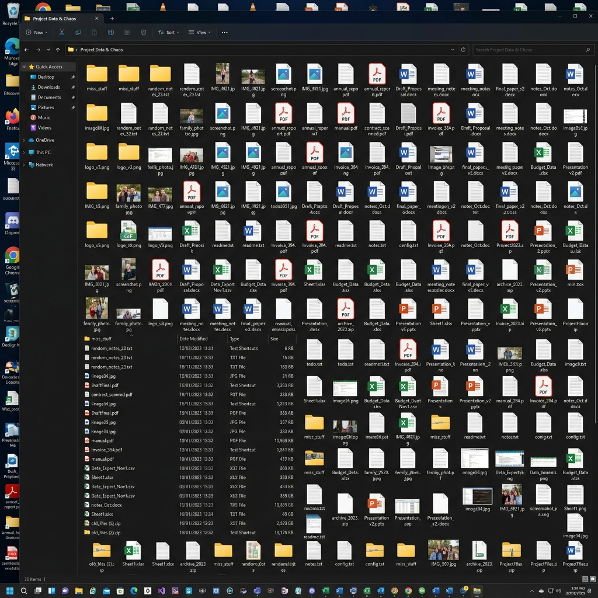
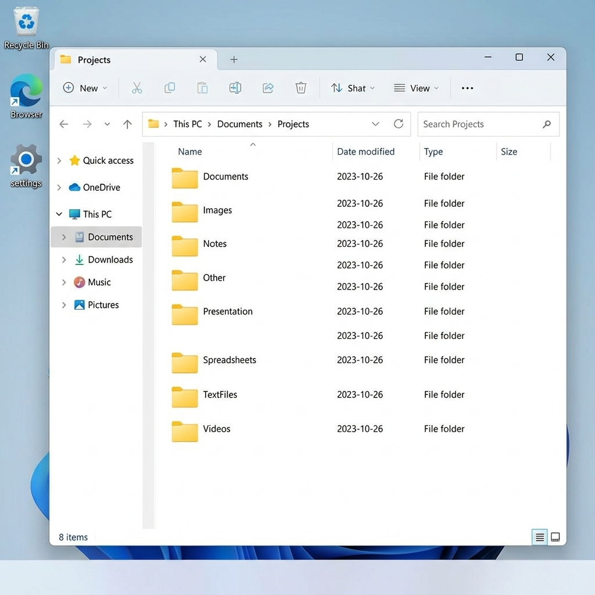

# Smart File Organizer

A simple Python script to automatically organize files in a directory into subfolders based on their file extensions.

## Features
- **Visual Folder Picker:** Uses a native popup window (via `tkinter`) to easily select the folder you want to organize.
- **Auto-Cleanup:** Automatically deletes any empty folders left behind after organizing.
- **Smart Grouping:** Organizes `.txt`, `.pdf`, `.jpg`, `.png`, `.mp4`, `.mp3`, `.zip`, `.csv`, `.pptx`, and more into respective folders.
- Any unmapped extensions are moved into an `Others` folder.
- Prevents overwriting files with the same name.
- Handles errors gracefully when moving files.

## Usage
Run the script using python:
```bash
python organizer.py
```
A popup window will appear asking you to select the directory you wish to organize. Select the folder, click OK, and the script will handle the rest!

## Screenshots

### Before Running


### Running the Script


### After Running

